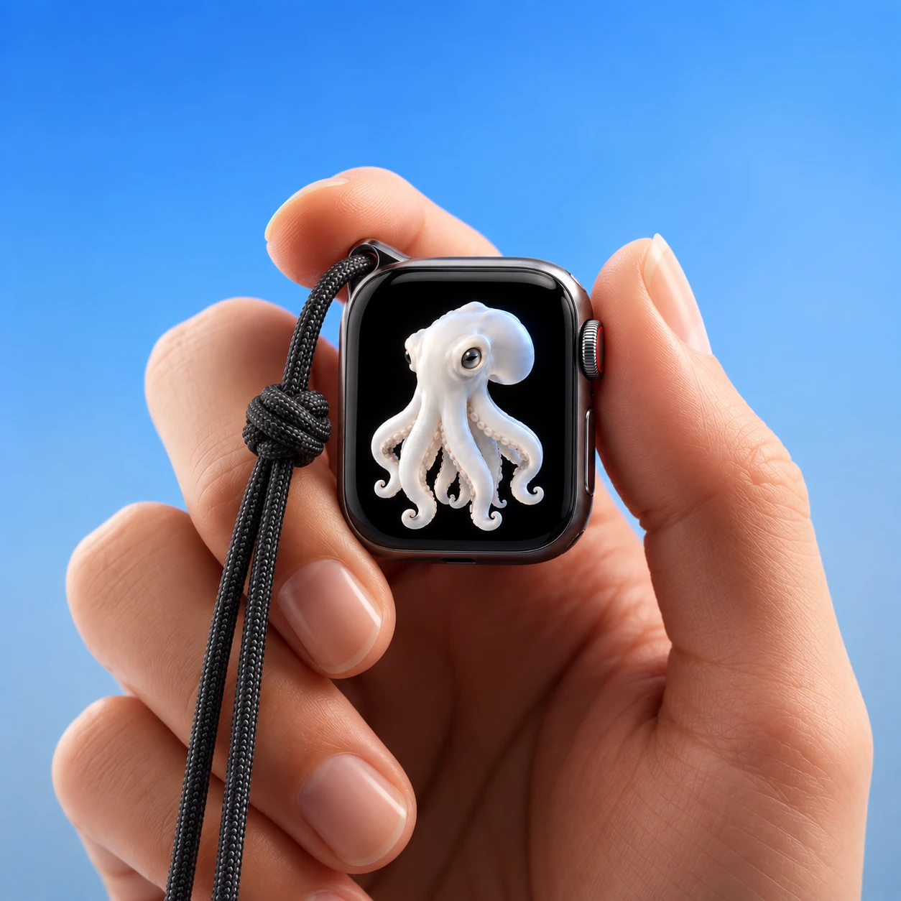
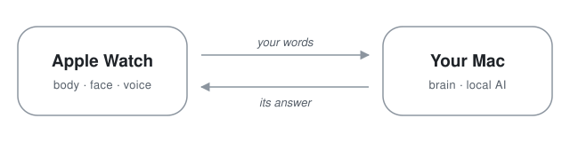

<h1 align="center">TamagoAI</h1>

<p align="center">
  
</p>

<p align="center"><em>A little intelligence with a life of its own.</em></p>

<br>
<br>

<p align="center">
  
</p>

<p align="center">
TamagoAI is a living AI companion for Apple Watch.<br>
The Watch is its body. Your Mac is its brain.
</p>

<br>
<br>

<h3 align="center">IT DOESN'T WAIT FOR YOU TO OPEN IT.<br>IT LIVES THERE.</h3>

<p align="center">
  
</p>

<p align="center"><sub>Motion prototype, awaiting owner review. Not final behavior.</sub></p>

<p align="center">
It drifts. It watches. It notices when you reach for it.<br>
Sometimes it slips past the edge of the screen and comes back somewhere else.
</p>

<br>
<br>

<h3 align="center">THE WATCH IS THE BODY.<br>THE MAC IS THE BRAIN.</h3>

<p align="center">
Hold anywhere and speak. Your words travel to a Mac at home,<br>
where the thinking happens on your own machine. Then Tamago answers.
</p>

<p align="center">
  <picture>
    <source media="(prefers-color-scheme: dark)" srcset="docs/assets/body-brain-dark.svg">
    
  </picture>
</p>

<br>

<h3 align="center">MEET TAMAGO.</h3>

<p align="center"><em>Curious. Quiet. Occasionally somewhere else.</em></p>

<p align="center">
  
</p>

<p align="center">
Not a chatbot on a tiny screen. Not a voice assistant in costume.<br>
No chat bubbles, no spinners, no status bars. The creature is the interface.
</p>

<br>
<br>

---

## Building it

TamagoAI is experimental and not yet on a physical Apple Watch. What follows is
the engineering behind it, with every claim labeled by how it was verified
([`AGENTS.md`](AGENTS.md) §3).

### Current status

- **The Watch ↔ Mac loop works end to end in the simulator.** Hold on the
  creature, speak through system dictation, the request travels to the Mac,
  the answer comes back, and the creature reacts, then returns to its idle life.
  `SIMULATOR_VERIFIED_ONLY`.
- **Pairing, not addresses.** The Mac gateway shows a one-time 6-digit code.
  The Watch keeps the resulting credential in its Keychain and finds the Mac at
  `tamagoai.local`. Nobody types an IP address. `SIMULATOR_VERIFIED_ONLY`.
- **When the Mac is away, the creature keeps living.** It carries on its idle
  life offline and reconnects by itself when the Mac returns.
  `SIMULATOR_VERIFIED_ONLY`.
- **Speech and creature sounds** are built, off by default, and not yet heard
  on hardware. No approved sound assets exist yet.
- **Character art:** the approved reference art above is the visual ground
  truth. The app currently draws a procedural placeholder until final art
  passes the [Visual Approval Gate](docs/VISUAL_APPROVAL_GATE.md).
- **Nothing has been verified on a physical Apple Watch.** Apple's own guidance
  (TN3135) says Watch networking can behave differently on hardware than in the
  simulator, so this matters.

### How it works

```text
 idle ─hold─▶ listening ─▶ acknowledging ─▶ thinking ─▶ (Mac gateway → local AI) ─▶ speaking ─▶ reaction ─▶ idle
```

A pure Swift state machine owns what the creature is doing, and a separate
engine drives its autonomous idle life. Neither touches the network. They emit
effects that a thin platform layer executes: an HTTP request, a haptic, speech
or a sound. The Mac side is a dependency-free Node gateway with pairing, request
IDs, timeouts, duplicate protection and a swappable AI provider: a deterministic
mock, or the Tamago Brain: memory, familiarity and routing around a local model through Ollama
(verified with `llama3.2:3b` on the owner's Mac, [`docs/BRAIN_EVAL.md`](docs/BRAIN_EVAL.md)).

### Architecture

[`docs/ARCHITECTURE.md`](docs/ARCHITECTURE.md) ·
[diagram](docs/TAMAGO_ARCHITECTURE.md) ·
[decisions](docs/DECISIONS.md) (D-115 transport, D-116 pairing, discovery and voice) ·
[protocol v1](docs/PROTOCOL_V1.md)

### Development

```sh
# Mac gateway: no dependencies, mock AI provider built in
cd Gateway && npm test
TAMAGO_HOST=0.0.0.0 npm start          # LAN: prints a pairing code, publishes tamagoai.local
TAMAGO_ALLOW_NO_AUTH=1 npm start       # loopback-only dev mode, no auth

# Shared Swift logic: runs on the Mac, no simulator needed
swift test --package-path Apple/Shared --scratch-path .build/spm
```

On the owner's Mac, builds, AI models, databases and caches all live on the
external `/Volumes/Storage` disk, never the internal one
([`AGENTS.md`](AGENTS.md) §9).

Building the Watch app, pairing a simulator and driving the full loop are in
[`docs/DEVELOPMENT.md`](docs/DEVELOPMENT.md). Mock provider commands are in
[`Gateway/mock/README.md`](Gateway/mock/README.md).

### Tests

| Suite | Count | Where |
|---|---|---|
| Swift (`Apple/Shared`) | 140 | host (`swift test`) and the watchOS 27 simulator (`xcodebuild test`) |
| Gateway (`Gateway/test`) | 113 | Node test runner |

`UNIT_TESTED_ONLY` means the tests passed, not that the feature was seen
working. Simulator and device evidence is recorded separately in
[`docs/HANDOFF_LOG.md`](docs/HANDOFF_LOG.md) and [`docs/DEVICE_TEST_LOG.md`](docs/DEVICE_TEST_LOG.md).

### Documentation

- [Creature specification](docs/CREATURE_SPEC.md): behavior, personality, mood
- [Visual approval gate](docs/VISUAL_APPROVAL_GATE.md): how character motion gets approved
- [Product presentation](docs/PRODUCT_PRESENTATION.md): how TamagoAI presents itself
- [Development guide](docs/DEVELOPMENT.md): setup, commands, simulator hooks
- [Handoff log](docs/HANDOFF_LOG.md) and [agent worklog](docs/AGENT_WORKLOG.md): who did what, and how it was verified

### Roadmap

Verification on a physical Apple Watch. The owner hears speech and sounds and
chooses a voice. Final character art and approved motion replace the
placeholder. An iPhone relay if direct Watch-to-Mac networking proves unreliable
on hardware. Stronger LAN security (TLS or request signing).

### Contributing and experimental status

TamagoAI is a personal, experimental project built in the open by its owner
with AI coding agents. Every agent follows [`AGENTS.md`](AGENTS.md). It isn't
accepting outside contributions yet.

### Layout

```text
AGENTS.md / CLAUDE.md     rules for every coding agent (read first)
docs/                     spec, decisions, protocol, presentation, logs, prototypes
Apple/
  AppleTamago.xcodeproj   Watch app, complication, iPhone companion, tests
  Shared/                 TamagoShared: protocol, state machine, transport, connection model + tests
  WatchApp/               the creature, TamagoConnection, pairing, voice, speech, sound
Assets/CharacterReference/  owner-approved character art
Gateway/                  Mac gateway (Node ≥22, no dependencies)
Tests/Fixtures/protocol-v1/   JSON fixtures shared by gateway + Swift tests
```

### Principles

Local AI first. No private APIs. No fake background modes. No secrets in Git.
No passcode bypass or wrist spoofing. Physical-device evidence beats assumptions.
