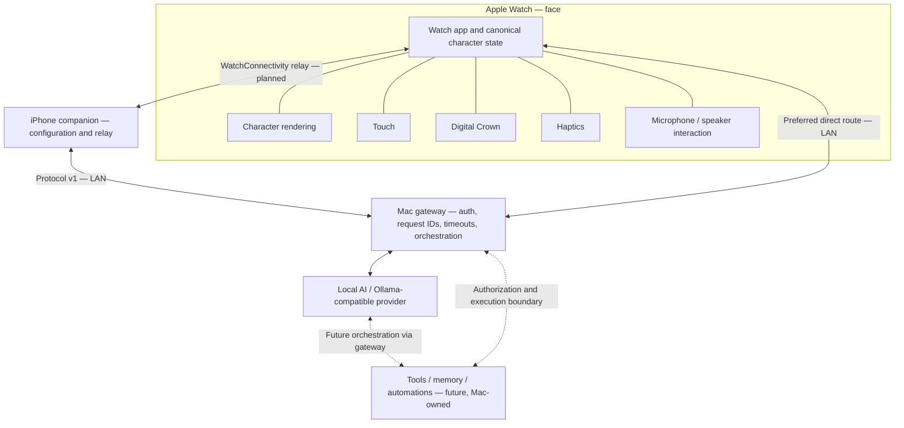

# TamagoAI architecture visual

This diagram describes intended responsibilities, **UNVERIFIED** as an
end-to-end system. [DECISIONS.md](DECISIONS.md) is authoritative; see
[HANDOFF_LOG.md](HANDOFF_LOG.md) for component-specific test evidence. It does
not assert that the current character branch implements voice or transport.

The iPhone is an optional relay/configuration companion; the direct Watch → Mac
route remains part of V1 (D-107–D-109). The Watch owns presentation and input;
models, provider selection and future tools stay on the Mac. The provider/tools
link is conceptual: tool execution must go through gateway authorization, not
arbitrary model-issued actions. Memory and automations are future scope.

Voice is planned as system dictation input and on-Watch speech output (D-106),
not raw audio upload in protocol v1. A local LLM does not imply that system
dictation is always offline. Complications are snapshots, not a continuously
running character. No keep-alive or background animation is promised.

Gateway adapter integration with a real local engine remains
**UNVERIFIED_LOCAL_PROVIDER** absent new recorded evidence. No public gateway or
Ollama exposure; remote/cellular transport requires a separate reviewed design.

The Mermaid block can be embedded in the GitHub README. Its future raster
export is `docs/media/architecture.png`; see [capture guide](MEDIA_CAPTURE_GUIDE.md).
For protocol fields use [PROTOCOL_V1.md](PROTOCOL_V1.md), and for detailed component
boundaries consult [ARCHITECTURE.md](ARCHITECTURE.md) together with newer decisions
(the architecture overview retains historical Phase 1 status text).
