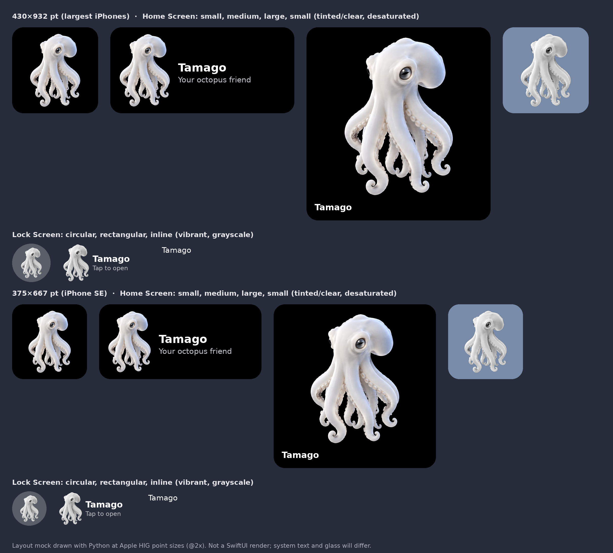

# iPhone widgets (D-122)

**Build status (2026-09-27):** Xcode 27 simulator build and unsigned Release archive succeed with
both extensions embedded. Shared Swift: 147 tests pass; gateway: 132 pass, 2 skipped.
**Visual status: UNVERIFIED on hardware after this fix.** Native Xcode/Device Hub UI automation timed out,
so compile success is not evidence that all widget appearances were rendered. See the release handoff.

**Scope (owner, 2026-09-27):** put our octopus in every iPhone widget size, and have a tap open the app.
Nothing else yet. Later passes can add mood, the last reply, or a talk button.

*The image above is a layout mock drawn with Python at the HIG point sizes, not a SwiftUI render.*

## 1. Sizes (Apple HIG, Widgets > Specifications > iOS dimensions)

| Screen (portrait, pt) | Small | Medium | Large | Circular | Rectangular | Inline |
|---|---|---|---|---|---|---|
| 430×932 | 170×170 | 364×170 | 364×382 | 76×76 | 172×76 | 257×26 |
| 428×926 | 170×170 | 364×170 | 364×382 | 76×76 | 172×76 | 257×26 |
| 414×896 | 169×169 | 360×169 | 360×379 | 76×76 | 160×72 | 248×26 |
| 414×736 | 159×159 | 348×157 | 348×357 | 76×76 | 170×76 | 248×26 |
| 393×852 | 158×158 | 338×158 | 338×354 | 72×72 | 160×72 | 234×26 |
| 390×844 | 158×158 | 338×158 | 338×354 | 72×72 | 160×72 | 234×26 |
| 375×812 | 155×155 | 329×155 | 329×345 | 72×72 | 157×72 | 225×26 |
| 375×667 | 148×148 | 321×148 | 321×324 | 68×68 | 153×68 | 225×26 |
| 360×780 | 155×155 | 329×155 | 329×345 | 72×72 | 157×72 | 225×26 |

**Which families iPhone supports:**

- Home Screen / Today View: **small, medium, large, extra-large portrait (iOS 27)**. Small also appears in **StandBy** and **CarPlay**,
  scaled up with the background removed.
- Lock Screen: **accessory circular, rectangular, inline**.
- Not on iPhone: **landscape extra large** (iPad, Mac and Vision Pro) and **accessory corner** (Apple Watch only).

The widget ships all seven iPhone families, including `systemExtraLargePortrait`, introduced on iOS 27.
The older size table and mock above predate this new family; layouts adapt to the size proposed by WidgetKit.

## 2. Keeping the octopus undistorted

- **Aspect ratio:** the art is portrait (488 × 692 px, width:height ≈ 0.705) and every widget family has
  a different shape.
  - The art is always *fitted* (`.aspectRatio(0.705, contentMode: .fit)`), never stretched or cropped,
    and it's sized from the space SwiftUI offers rather than fixed points. The same code is right on
    every iPhone in the table.
  - **Square families** (small, circular): the octopus is centered and limited by height.
  - **Wide families** (medium, rectangular): the octopus sits on the left at full height and the name
    fills the rest.
  - **Large and extra-large portrait:** the octopus fills most of the widget, with the name below.
- **Margins** (HIG): 16 pt around text and 11 pt around graphics. Default content margins are turned off
  (`contentMarginsDisabled`), so each family can use these exact values.
- **The black background had to go.** On tinted and clear Home Screens (iOS 18+ / Liquid Glass), the
  system removes the widget background and paints any *opaque* image a single solid white. The JPG art,
  black background included, would become a white rectangle.
  - `CreatureCutout.png` is the approved `ref_hero_q34.jpg` with **only its black background made
    transparent**. The octopus's own pixels are untouched.
  - How the background was found: near-black regions connected to the image edge, plus three pure-black
    pockets trapped between tentacles. The eyes are dark but not pure black, and they stay opaque.
  - Reproducible with `tools/widget-art/make_cutout.py`.
- **Rendering modes:**

  | Mode | Where | What Tamago shows |
  |---|---|---|
  | full color | Home Screen light/dark, StandBy, CarPlay | octopus on black (the black background is removable) |
  | accented | tinted / clear Home Screen | the cutout, `.desaturated` (keeps eyes and shading) on the system glass |
  | vibrant | Lock Screen, StandBy at night | brightness drives vibrancy: the white body is bright, the eyes stay dark |

- **Resolution:** the source art is 692 px tall. The art in the large widget is ~320 pt tall, so ~960 px at @3x. It's scaled
  up about 1.4× there. It will look slightly soft; a larger master from the art pipeline fixes that later.

## 3. What's in the repo

| Path | What |
|---|---|
| `Apple/PhoneWidget/TamagoPhoneWidgets.swift` | `@main` widget bundle, the widget configuration (7 families, `widgetURL`), a static timeline (one entry, `.never`) |
| `Apple/PhoneWidget/CreatureWidgetView.swift` | layout per family, container background, accessibility label, Xcode previews for all 7 |
| `Apple/PhoneWidget/Assets.xcassets/CreatureCutout.imageset` | the cutout PNG |
| `Apple/PhoneWidget/Info.plist` | `NSExtensionPointIdentifier = com.apple.widgetkit-extension` (same as the complication) |
| `tools/widget-art/make_cutout.py` | regenerates the cutout from the approved art (Python + Pillow + NumPy) |

- **Tap:** tapping any size opens the app. `widgetURL` is `tamago://widget/creature`. The iPhone app doesn't
  need a URL scheme for widget taps and currently ignores the URL. It can route on it later with
  `.onOpenURL`.
## 4. Build integration and watchOS 27 correction

`Apple/AppleTamago.xcodeproj` now contains `TamagoPhoneWidget`, synchronized with `Apple/PhoneWidget`,
embedded in `TamagoPhone/PlugIns`. `Info.plist` is excluded from copied resources. The extension uses
Automatic signing and the existing local/cloud configuration; there are no new credentials or App Groups.
All app/extension marketing versions are 0.1.2.

The Watch extension uses an exact copy of `CreatureCutout.png` as `Octopus.png`. The previous artwork
had an opaque black background, and circular content also drew an opaque black `Color` layer. In
accented rendering, that foreground layer can become a solid white disk. It is removed; the only black
background is the system-managed `containerBackground`. The image keeps `.desaturated` so shading and
eyes can survive accented rendering. Apple explicitly says watchOS ignores `.fullColor` overrides.
All four Watch families remain; inline now includes the small octopus symbol with its name.

The original opaque artwork and the user's white-complication report are evidence for this diagnosis;
the fix still requires confirmation on that physical watch face. Inline layouts are system-templated
symbols, so they cannot show the same photographic detail as larger families.

Release acceptance on hardware:
- Check Watch circular, corner, rectangular/Smart Stack and inline in a supported face, including tinted
  faces and reduced luminance. The creature must remain recognizable; tap must open Tamago.
- Check iPhone small, medium, large and extra-large portrait in Default, Dark, Tinted and Clear.
- Check circular, rectangular and inline on the Lock Screen; tap each to open Tamago.
- Check the small widget in StandBy/CarPlay when those contexts are available.
- After updating, remove/re-add a widget only if the system continues showing its old cached snapshot.

## 5. Not done, on purpose

- No state in the widget yet: no mood, no last reply, no App Group. Later that's D-105's snapshot, shared
  through an App Group.
- No Control Center control and no Live Activity. These are separate widget kinds, easy to add to the same
  bundle later.
- No motion. Widgets can't run free animation, and any creature motion still needs the Visual Approval Gate.

## Sources

- Apple HIG, Widgets (families, contexts, rendering modes, margins, StandBy, the iOS dimensions table):
  https://developer.apple.com/design/human-interface-guidelines/widgets
- Optimizing your widget for accented rendering mode and Liquid Glass ("tints opaque images with a single
  white color"; use `desaturated` for images):
  https://developer.apple.com/documentation/widgetkit/optimizing-your-widget-for-accented-rendering-mode-and-liquid-glass
- `widgetAccentedRenderingMode(_:)` (iOS 18+):
  https://developer.apple.com/documentation/swiftui/image/widgetaccentedrenderingmode(_:)
- Preparing widgets for additional contexts and appearances (rendering-mode switch, removable backgrounds,
  StandBy/CarPlay use systemSmall):
  https://developer.apple.com/documentation/widgetkit/preparing-widgets-for-additional-contexts-and-appearances
- `contentMarginsDisabled()`:
  https://developer.apple.com/documentation/swiftui/widgetconfiguration/contentmarginsdisabled()
- `showsWidgetContainerBackground`:
  https://developer.apple.com/documentation/swiftui/environmentvalues/showswidgetcontainerbackground

- Apple WWDC26, WidgetKit foundations (new iOS 27 portrait XL):
  https://developer.apple.com/videos/play/wwdc2026/277/
- `systemExtraLargePortrait`:
  https://developer.apple.com/documentation/widgetkit/widgetfamily/systemextralargeportrait
